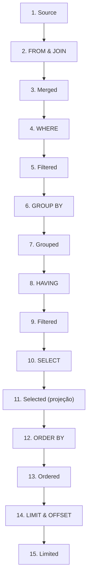

# Ordem de execução das consultas SQL
Guia visual e lógico detalhando a sequência exata de execução interna das cláusulas em consultas SQL.

1. Source
2. `FROM` e `JOIN`
3. Merged
4. `WHERE`
5. Filtered
6. `GROUP BY`
7. Grouped
8. `HAVING`
9. Filtered
10. `SELECT`
11. Selected (*projeção*)
12. `ORDER BY`
13. Ordered
14. `LIMIT` e `OFFSET`
15. Limited

